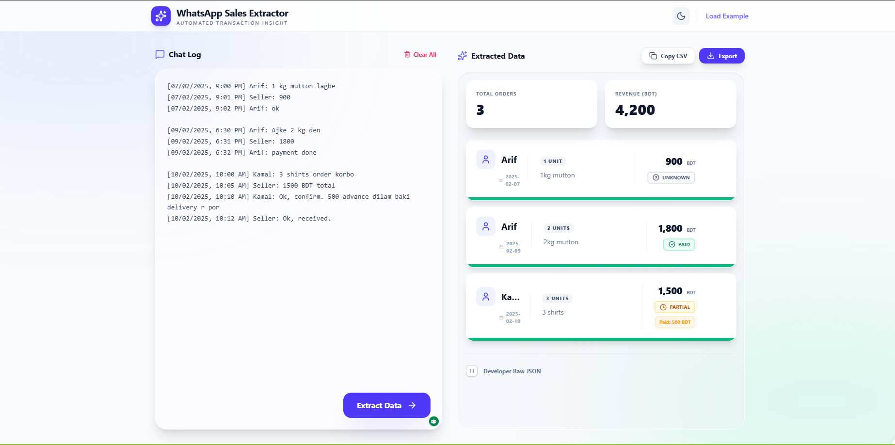

# Chat2Sale Report 🚀

A premium AI-powered tool to extract structured financial transactions from WhatsApp chat logs using **Gemini 2.5 Flash**.



## ✨ Features

- **AI-Powered Extraction**: Automatically identifies customers, items, amounts, and payment statuses from messy chat logs.
- **Support for Mixed Languages**: Works with English, Bangla, and Romanized Bangla (Banglish).
- **Interactive Dashboard**: View real-time analytics including total orders and revenue summaries.
- **Export Capabilities**: Instantly copy data as CSV or download it for Excel/Google Sheets.
- **Premium UI/UX**: Includes a sleek Dark Mode, responsive design, and smooth animations.
- **High Accuracy**: Uses advanced system prompts to ensure only confirmed transactions are processed.

## 🛠️ Technology Stack

- **Core**: React 19 + TypeScript
- **AI**: Google Gemini 2.5 Flash
- **Styling**: Tailwind CSS 4
- **Animations**: Motion (Framer Motion)
- **Icons**: Lucide React

## 🚀 Getting Started

### Prerequisites

- Node.js (v18+)
- A Gemini API Key from [Google AI Studio](https://aistudio.google.com/)

### Installation

1. Clone the repository:

   ```bash
   git clone <your-repo-url>
   cd Whatsapp-Sales-Extractor
   ```

2. Install dependencies:

   ```bash
   npm install
   ```

3. Configure Environment Variables:
   Create a `.env` file in the root directory and add your API key:

   ```env
   VITE_GEMINI_API_KEY=your_api_key_here
   ```

4. Run the application:
   ```bash
   npm run dev
   ```

## 📝 Usage

1. Open the application in your browser (usually `http://localhost:3000`).
2. Paste any WhatsApp conversation into the **Chat Log** area.
3. Click **Extract Data** to see the AI magic.
4. Export the results to your favorite accounting tool.

---

_Note: For the image to appear in this README, please save your screenshot as `app-screenshot.png` in the root folder._
